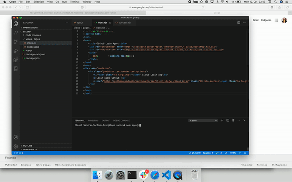

# Simple Node.js application that uses GitHub login

## Description

Node.js web application that uses GitHub login to show the user's profile information. 

*Note: ClientID and ClientSecret have been removed from the repository. You can create get your own credentials here: https://github.com/settings/applications/new *

## Steps

1. Create a Github OAuth Application
2. Write the application back-end code to access GitHub authentication
3. Create the views - login view and then once then login is successfull the profile view

I used:
- express: Node.js framework to create a server and accept requests
- ejs: For the HTML views/pages
- axios: To make HTTP requests
